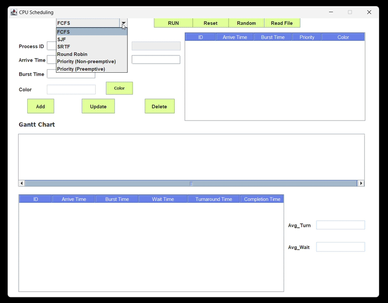

# CPU Scheduling Simulator App

## Overview

The **CPU Scheduling Simulator App** is a Java-based desktop application designed to simulate various CPU scheduling algorithms. It provides an interactive and visual way for users to understand the mechanics and performance of different scheduling techniques, such as First Come First Serve (FCFS), Shortest Job First (SJF), and others.

This project was developed as part of **Base Learning 4** in my university coursework, aimed at enhancing understanding of operating system concepts.

---

## Features

- **Supported Scheduling Algorithms**:
  - **First Come First Serve (FCFS)**
  - **Shortest Job First (SJF)**
  - **Shortest Remaining Time First (SRTF)**
  - **Round Robin (RR)**
  - **Priority Scheduling**:
    - Non-preemptive
    - Preemptive
- **Customizable Inputs**:
  - Add processes with specific burst time, arrival time, priority, and time quantum.
- **Interactive Simulation**:
  - Gantt Chart visualization of CPU scheduling.
  - Performance metrics displayed, including:
    - Average waiting time.
    - Average turnaround time.
    - CPU utilization.
- **User-friendly Interface**:
  - Easy-to-use dropdown menu to select algorithms.
  - Clear and concise output displays.
  - Read input from `txt` file.

---

## Demo



---

## Requirements

- **Java Development Kit (JDK)**: Version 17 or later
- **Java Runtime Environment (JRE)**: Version 17 or later
- **Operating System**: Windows

---

## Installation

1. Clone the repository:
   ```bash
   https://github.com/hilu03/CPU-Scheduling-Simulator-App.git
2. Navigate to the project directory:
    ```bash
   cd CPU-Scheduling-Simulator-App
3. Locate the `MyMain.java` file inside the `CPU_Scheduling` folder.
4. Run the `MyMain.java` file to start the application.   

---

## Acknowledgements

- This project was created by **Luong** (me) [GitHub: @hilu03] and **Khanh** [GitHub: @zkai1530].
- Special thanks to **Khanh** for her valuable contributions in developing the algorithms and the user interface.